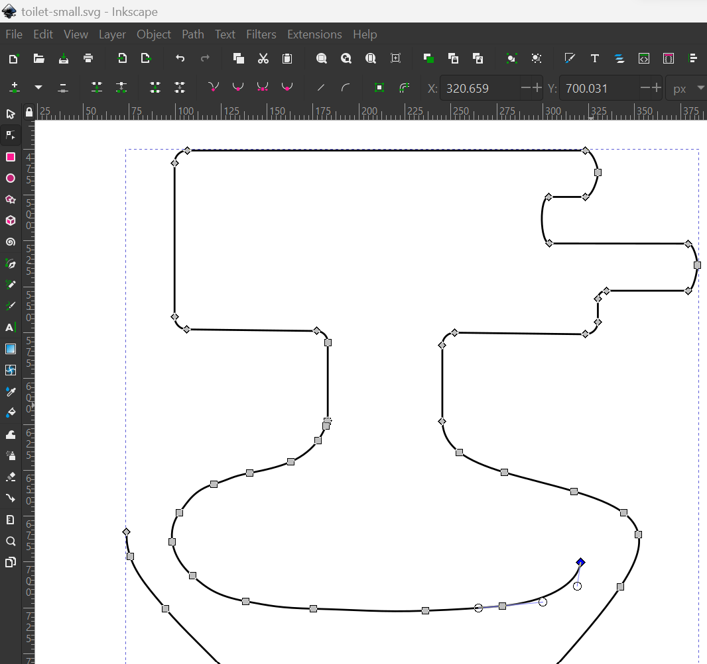
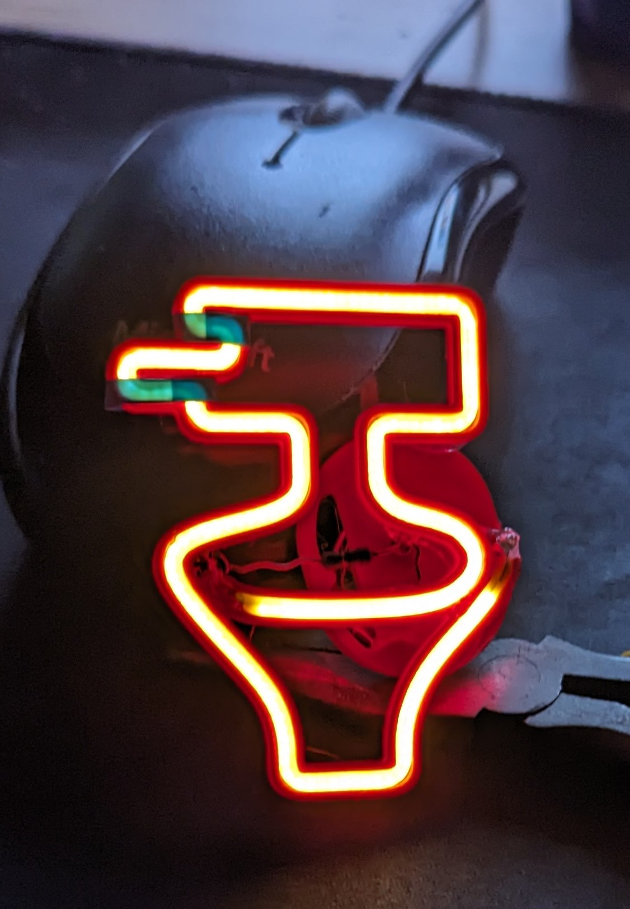

# Generator for 3D printed LED-neon supports

Create 3D-printable channels for holding flexible led strips/"neon" from an SVG for example drawn in [Inkscape](https://inkscape.org/).

## Example

### 1. Create a design

### 2. Generate STL + print
`python neon.py -p noodle -l 260mm examples/toilet-small.svg`

### 3. Profit

